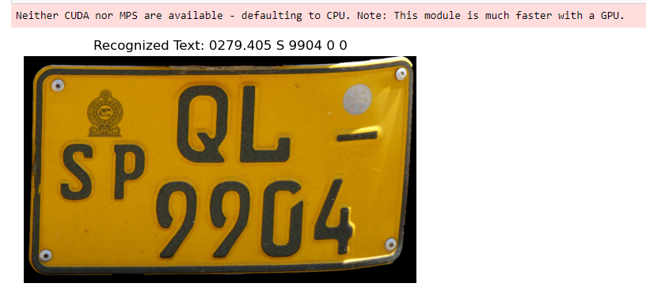

```diff
This used to install the easyOCR library to the local environment
-pip install easyocr

import the opencv
-import cv2
import the easyOCR library 
-import easyocr
import the data visualization library matplotlib as plt
-from matplotlib import pyplot as plt


-def preprocess_image(image_path):
    load the Image
-    img = cv2.imread(image_path)
    
    convert the image to grayscale
-    gray = cv2.cvtColor(img, cv2.COLOR_BGR2GRAY)
    
    Apply Gaussian blur to reduce noice and improve OCR accuracy
-    blurred = cv2.GaussianBlur(gray, (5, 5), 0)
    
-    return blurred

-def perform_ocr(image, reader):
    perform OCR on the preprocessed image
-    result = reader.readtext(image)
    
    Extract and return the recognized text
-    recognized_text = ' '.join(entry[1] for entry in result)
-    return recognized_text

-def display_image_with_results(image, recognized_text):
    Display the image with recognized text
-    plt.imshow(cv2.cvtColor(image, cv2.COLOR_BGR2RGB))
-    plt.title(f"Recognized Text: {recognized_text}")
-    plt.axis('off')
-    plt.show()

-def number_plate_recognition(image_path):
     Preprocess the image
-    preprocessed_image = preprocess_image(image_path)

     Create an OCR reader using the 'en' language for English text
-    reader = easyocr.Reader(['en'])

     Perform OCR on the preprocessed image
-    recognized_text = perform_ocr(preprocessed_image, reader)

     Display the results
-    display_image_with_results(cv2.imread(image_path), recognized_text)


-image_path = 'C:\\Users\\Hasitha\\Desktop\\kanikaSir\\easyocrproject\\numberplate.jpg'
-number_plate_recognition(image_path)
```


