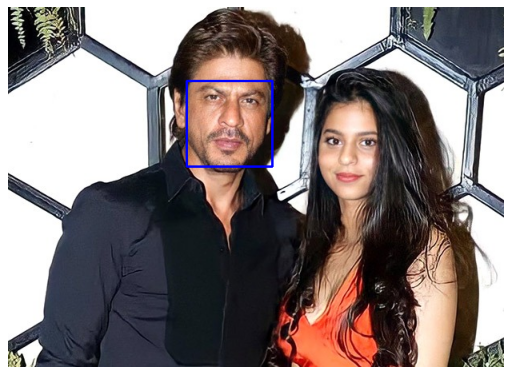

```diff
This is library is used for recognize and manipulate the human faces from python. In here I mentioned the command for install the packages which are used to face recognition techniques.
- pip install face_recognition opencv-python

In here I mentioned the face_recognition library import to my code base. Then the second line I mention the open-cv library import as cv2 to my code base, Then in the 3rd line I mention the numpy package (which used to handle mathematical equations in python) I import as np renamed, then lastly data visualizing matplotlib library I import to my codebase.
- import face_recognition
- import cv2
- import numpy as np
- import matplotlib.pyplot as plt

This code line is the specific code for jupyter notebook or other python environments. It allows to plots to be displayed directly within the notebook interface. 
- %matplotlib inline

- import matplotlib.pyplot as plt

Import to the code base image submodule by matplotlib. This is used to read and manipulate the image files (PNG, JPG, JPEG) 
- import matplotlib.image as mpimg
This use to read the image which mentioned the specific directory
- img = mpimg.imread('C:\\Users\\Hasitha\\Desktop\\kanikaSir\\IM\\Shah-Rukh-Khan-to-pair-up-for-the-first-time-with-daughter-Suhana-620.jpg')

In this mention the image plot command using the imshow() function and then using show() command display the image which I mentioned in the previous command.
- imgplot = plt.imshow(img)
- plt.show()

```


```diff
 


In here I use template matching technique, so in here I read the another image which include only for face which I recognize.
- img2 = mpimg.imread('C:\\Users\\Hasitha\\Desktop\\kanikaSir\\IM\\download.jpg')
- imgplot = plt.imshow(img2)
- plt.show()

```


```diff
 
```
**Now in previous code I mention how to read the two images for template matching technique, so in here I write the code for a function which include the both two images and region of interest part which should be use to design the square like bounding box around the identifies face, here this is the code for that.**

```diff

- def compare_and_mark_faces(main_image_path, target_image_path):
    
    Load the main image and the target image
-     main_image = face_recognition.load_image_file(main_image_path)
-     target_image = face_recognition.load_image_file(target_image_path)

    The Face location function detects the all pages which are having in the image, and then return the list of tuple where each tuple correspond to the location of the face.
-     main_face_locations = face_recognition.face_locations(main_image)
-     target_face_locations = face_recognition.face_locations(target_image)
    
This face encoding function is used to identify the facial features, like distance between eyes, the shape of chin, the contours of the lips like wise.
-     main_face_encodings = face_recognition.face_encodings(main_image, main_face_locations)
-     target_face_encodings = face_recognition.face_encodings(target_image, target_face_locations)


    Create a copy of the main image array for visualization
-     main_image_marked = np.copy(main_image)

    Iterate through faces in the main image
-     for main_face_location, main_face_encoding in zip(main_face_locations, main_face_encodings):
        Compare the face encoding with all face encodings in the target image
-         results = face_recognition.compare_faces(target_face_encodings, main_face_encoding)

        Check if there is at least one match
-         if True in results:
            Find the index of the first matching face in the target image
-             target_index = results.index(True)

            Draw a blue bounding box around the matching face in the main image
-             top, right, bottom, left = main_face_location
	In here left,top,right,botton has default coordinates from face location function then 2 means the border size of the rectangle the the 0,0,255 means the pure blue colored border
-             cv2.rectangle(main_image_marked, (left, top), (right, bottom), (0, 0, 255), 2)

In here display the main image with mentioning the bounding box view.    
-     plt.imshow(main_image_marked)
-     plt.axis('off')  # Turn off axis labels (cleanly display images without any axis information) 
-     plt.show()

Specify the paths to the main image and the target image
- main_image_path = "C:\\Users\\Hasitha\\Desktop\\kanikaSir\\IM\\Shah-Rukh-Khan-to-pair-up-for-the-first-time-with-daughter-Suhana-620.jpg"
- target_image_path = "C:\\Users\\Hasitha\\Desktop\\kanikaSir\\IM\\download.jpg"

Call the function for face comparison and marking
- compare_and_mark_faces(main_image_path, target_image_path)

```


 


