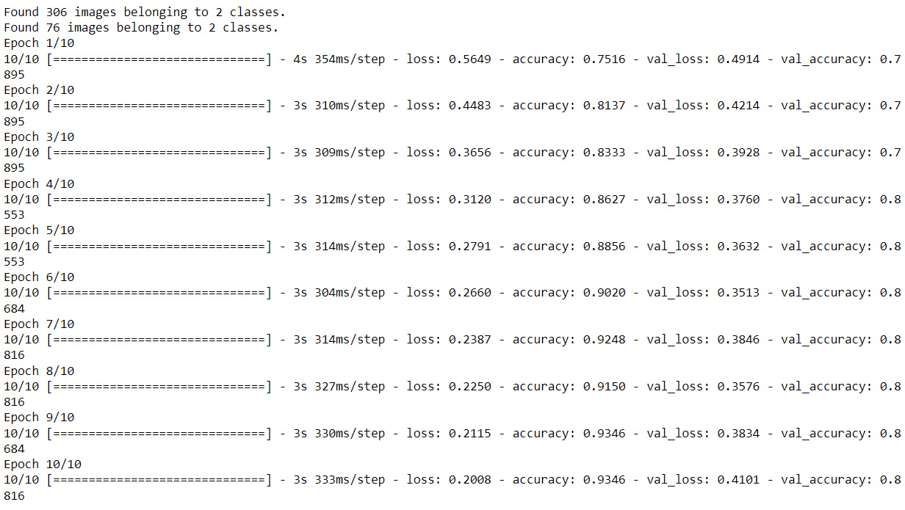
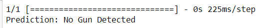

```diff
-import tensorflow as tf

ImageDataGenerator: This class generates batches of augmented data by applying       various transformations to input images.
load_img: This function loads an image from a file path and returns a PIL (Python Imaging Library) image object.
img_to_array: Converts a PIL image to a NumPy array.

-from tensorflow.keras.preprocessing.image import ImageDataGenerator, load_img, img_to_array
-import os

PIL is the image module from the python library
-from PIL import Image


Get the absolute path to the dataset
-dataset_path = 'gun-detection-model-from-gpu/dataset/training'
-absolute_path = os.path.abspath(dataset_path)

Load the pre-trained VGG16 model
-base_model = tf.keras.applications.VGG16(weights='imagenet', include_top=False, input_shape=(224, 224, 3)) #Size of the image
-base_model.trainable = False

Create a custom model for fine-tuning
-model = tf.keras.Sequential([
-    base_model,
reduce the complexity of the prev tensor derived from the input by averaging the pixel distributions. So learning will be easy
-    tf.keras.layers.GlobalAveragePooling2D(),
-    tf.keras.layers.Dense(256, activation='relu'),
randomly deactivate nerouns to prevent overfitting on features by some neurons. 0.5 represent the % of neurons impacted by the dropout feature
-    tf.keras.layers.Dropout(0.5),
-    tf.keras.layers.Dense(1, activation='sigmoid')  # Binary classification (gun or not)
-])

Compile the model
-model.compile(optimizer='adam', loss='binary_crossentropy', metrics=['accuracy'])

Data preparation with data augmentation. Larger batch sizes are good to make the models to be more mature. However, it could lead to stuck due to memory shortages. Hence, trial and error experimentations are required.
-batch_size = 32
augment the images on the go as per the specs given during the training
-train_datagen = ImageDataGenerator(
-    rescale=1./255,
-    validation_split=0.2,
-    rotation_range=20,
-    width_shift_range=0.2,
-    height_shift_range=0.2,
-    shear_range=0.2,
-    zoom_range=0.2,
-    horizontal_flip=True,
-    fill_mode='nearest'
-)
configured pipeline of datagenerator is directly linked to the folder
-train_generator = train_datagen.flow_from_directory(
-    absolute_path,
-    target_size=(224, 224),
-   batch_size=batch_size,
augment the images considering correct and wrong representations. this allow the model to learn with a comparative assesment.
-    class_mode='binary',
can be either training or validation. In validation mode, adjust the images to support the inferencing purposes.
-    subset='training'
-)

arrangement of the validation dataset.
-validation_generator = train_datagen.flow_from_directory(
-    absolute_path,
-    target_size=(224, 224),
-    batch_size=batch_size,
-    class_mode='binary',
-    subset='validation'
-)

Train the model with augmented data
-model.fit(
-    train_generator,
-    epochs=10,
-    validation_data=validation_generator
-)

Save the model
-model.save('gun-detection-model-from-gpu/custom_gun_model2.h5')
```

```diff
 
	
-model = tf.keras.models.load_model('C:\\Users\\Hasitha\\Desktop\\kanikaSir\\gun-detection-model-from-gpu\\custom_gun_model2.h5')
Test the prediction capability with a image
-new_image_path = 'C:/Users/Hasitha/Desktop/kanikaSir/gun-detection-model-from-gpu/dataset/23444.jpg'  
Load the new image. It also need to be pre-process as to suite with the configured model. Becz model has been trained with configured images and we need the same during the inferencing as well.

-new_image = load_img(new_image_path, target_size=(224, 224))
-new_image_array = img_to_array(new_image)

format the image data as needed by a deep learning model
-new_image_array = tf.expand_dims(new_image_array, 0)  # Add batch dimension
-new_image_array /= 255.0  # Rescale pixel values to [0, 1]

Make predictions
-prediction = model.predict(new_image_array)

Display the prediction
-if prediction > 0.2:
-    print("Prediction: Gun Detected")
-else:
-    print("Prediction: No Gun Detected")
```

