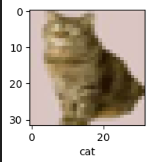
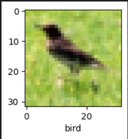
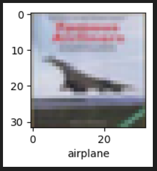

```diff
-import tensorflow as tf
-from tensorflow.keras import datasets, layers, models
-import matplotlib.pyplot as plt
-import numpy as np

-(X_train, y_train), (X_test,y_test) = datasets.cifar10.load_data()
-X_train.shape

-X_test.shape

-y_train.shape

-X_train[:5]

-y_train[:5]

This denotes it`s a 2D array
-y_train.ndim 

-y_train = y_train.reshape(-1,) # convert to 1d
-y_train[:5]

Now it has become 1d
-y_train.ndim

Re-shape the y axis as well
-y_test = y_test.reshape(-1,)

-classes = ["airplane","automobile","bird","cat","deer","dog","frog","horse","ship","truck"]

for image plotting
-def plot_sample(X, y, index):
-    plt.figure(figsize = (15,2))
-    plt.imshow(X[index])
-    plt.xlabel(classes[y[index]])

-plot_sample(X_train, y_train, 12225)
```

```diff 

-plot_sample(X_train, y_train, 45021)
```

 
```diff
normalize training data
-X_train = X_train / 255.0
-X_test = X_test / 255.0

simple ANN - accuracy is low compared to CNN
-ann = models.Sequential([
-        layers.Flatten(input_shape=(32,32,3)),
-        layers.Dense(3000, activation='relu'),
-        layers.Dense(1000, activation='relu'),
-        layers.Dense(10, activation='softmax')  # 10 classes to be outputed
-    ])

-ann.compile(optimizer='SGD',
-              loss='sparse_categorical_crossentropy',
-              metrics=['accuracy'])

-ann.fit(X_train, y_train, epochs=5)
derive a clasification report for the 10 classes
-from sklearn.metrics import confusion_matrix , classification_report
-import numpy as np
-y_pred = ann.predict(X_test)
-y_pred_classes = [np.argmax(element) for element in y_pred]

-print("Classification Report: \n", classification_report(y_test, y_pred_classes))

define high accurate CNN model
-cnn = models.Sequential([
-    layers.Conv2D(filters=32, kernel_size=(3, 3), activation='relu', input_shape=(32, 32, 3)),
-    layers.MaxPooling2D((2, 2)),

-    layers.Conv2D(filters=64, kernel_size=(3, 3), activation='relu'),
-    layers.MaxPooling2D((2, 2)),

-    layers.Flatten(),
-    layers.Dense(64, activation='relu'),
-    layers.Dense(10, activation='softmax')
-])

-cnn.compile(optimizer='adam',
-              loss='sparse_categorical_crossentropy',
-              metrics=['accuracy'])

-cnn.fit(X_train, y_train, epochs=5)

-cnn.evaluate(X_test,y_test)

-y_pred = cnn.predict(X_test)
-y_pred[:5]

-y_classes = [np.argmax(element) for element in y_pred]
-y_classes[:5]

-y_test[:5]

-plot_sample(X_test, y_test,3)
```

```diff 

-classes[y_classes[3]]
 ```
**Output : 'airplane'**
