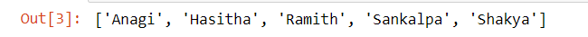
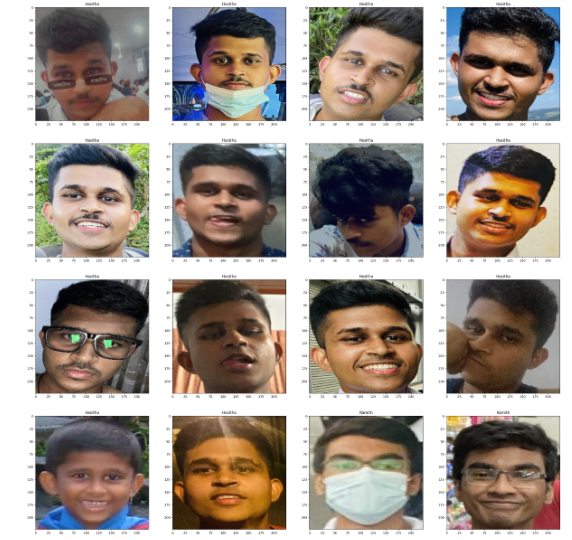
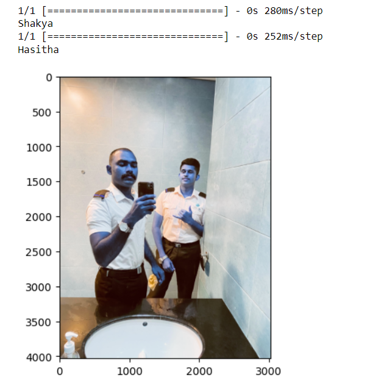
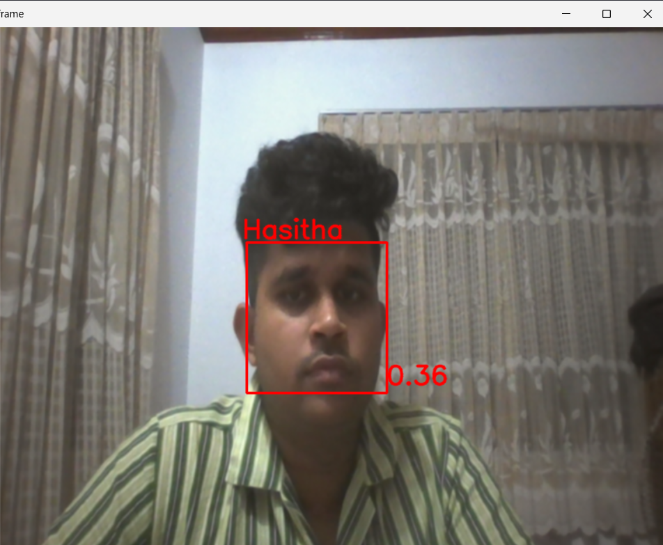

**Real-Time Face name detection algorithm**
```diff
This is use to manipulate numerical functions
-import numpy as np
This Pandas Library use data manipulation and analysis
-import pandas as pd 
This is use to data visualization
-import matplotlib.pyplot as plt
This use to create attractive high level visualization
-import seaborn as sns
-import cv2
This use to accessing file directories with and operating system in python 
-import os
This helps to find all the pathnames
-import glob as gb
This used to easier the progress of time-consuming tasks
-from tqdm import tqdm
This is the open source machine learning tool developed by google and it gives the tools for building and training deep neural network
-import tensorflow as tf
 This is use to built on top of NumPy and provides additional functionality for scientific and engineering computations
-import scipy as scipy

defining train data set
This ImageDataGenerator normally used in Tensorfor Keras library for data augementing and preprocessing
-from tensorflow.keras.preprocessing.image import ImageDataGenerator

Setting up process of the DataGenerator
-train_dir='C:\\Users\\Hasitha\\Desktop\\kanikaSir\\facenamedetection\\data'
-Train_Data=tf.keras.preprocessing.image.ImageDataGenerator(
     Randomly flips images horizontally during training (data augmentation)
-    horizontal_flip=True,
     Scales pixel values to the range [0,1]
-    rescale=1/255.0,
-).flow_from_directory(train_dir,batch_size=16,subset="training",target_size=(224,224),shuffle=False)

batch_size=16: Determines the batch size for training.
subset="training": Indicates that this data generator is for the training subset.
target_size=(224,224): Resizes input images to a consistent size of 224x224 pixels.
shuffle=False: Disables shuffling of data within each batch during training.
Print the data classes which mentioned including the datasets
-list(Train_Data.class_indices.keys())
```

 
```diff
-classes=list(Train_Data.class_indices.keys())
-plt.figure(figsize=(30,30))
-for X_batch, y_batch in Train_Data:
     create a grid of 7x7 images
-    for i in range(0,16):
-        plt.subplot(4,4,i+1)
-        plt.imshow(X_batch[i])
-        plt.title(classes[np.where(y_batch[i]==1)[0][0]])
     show the plot
-    plt.show()
-    break

```
 


```diff
-from tensorflow.keras.models import Sequential
-from tensorflow.keras.layers import ZeroPadding2D, Convolution2D, MaxPooling2D, Dropout, Flatten, Activation

Model Architecture is sequential
-def vgg_face():
-    model = Sequential()
-    model.add(ZeroPadding2D((1,1),input_shape=(224,224, 3)))
-    model.add(Convolution2D(64, (3, 3), activation='relu'))
     Add zero padding to the input images
-    model.add(ZeroPadding2D((1,1)))
-    model.add(Convolution2D(64, (3, 3), activation='relu'))
     The maxpooling layer reduces the spartial dimentions,
     Maxpooling layer reduces the size of feature maps, making them more manageable
     It help to prevent overfitting by reducing the number of parameters.
     Maxpooling layer makes feature detection invariant to sccale and orientation changes
-    model.add(MaxPooling2D((2,2), strides=(2,2)))
    
-    model.add(ZeroPadding2D((1,1)))
-    model.add(Convolution2D(128, (3, 3), activation='relu'))
-    model.add(ZeroPadding2D((1,1)))
-    model.add(Convolution2D(128, (3, 3), activation='relu'))
-    model.add(MaxPooling2D((2,2), strides=(2,2)))
    
-    model.add(ZeroPadding2D((1,1)))
-    model.add(Convolution2D(256, (3, 3), activation='relu'))
-    model.add(ZeroPadding2D((1,1)))
-    model.add(Convolution2D(256, (3, 3), activation='relu'))
-    model.add(ZeroPadding2D((1,1)))
-    model.add(Convolution2D(256, (3, 3), activation='relu'))
-    model.add(MaxPooling2D((2,2), strides=(2,2)))

-    model.add(ZeroPadding2D((1,1)))
-    model.add(Convolution2D(512, (3, 3), activation='relu'))
-    model.add(ZeroPadding2D((1,1)))
-    model.add(Convolution2D(512, (3, 3), activation='relu'))
-    model.add(ZeroPadding2D((1,1)))
-    model.add(Convolution2D(512, (3, 3), activation='relu'))
-    model.add(MaxPooling2D((2,2), strides=(2,2)))
    
-    model.add(ZeroPadding2D((1,1)))
-    model.add(Convolution2D(512, (3, 3), activation='relu'))
-    model.add(ZeroPadding2D((1,1)))
-    model.add(Convolution2D(512, (3, 3), activation='relu'))
-    model.add(ZeroPadding2D((1,1)))
-    model.add(Convolution2D(512, (3, 3), activation='relu'))
-    model.add(MaxPooling2D((2,2), strides=(2,2)))
    
-    model.add(Convolution2D(4096, (7, 7), activation='relu'))
-    model.add(Dropout(0.5))
-    model.add(Convolution2D(4096, (1, 1), activation='relu'))
-    model.add(Dropout(0.5))
-    model.add(Convolution2D(2622, (1, 1)))
-    model.add(Flatten())
-    model.add(Activation('softmax'))
-    return model

Load the model using directory
-model = vgg_face()

-model.load_weights('C:\\Users\\Hasitha\\Desktop\\kanikaSir\\facenamedetection\\vgg_face_weights.h5')

-from tensorflow.keras.models import Model
-model = Model(inputs=model.layers[0].input, outputs=model.layers[-2].output)

Display The Model Summary
-model.summary()

This is use to detect the face as region of interest
-from facenet_pytorch import MTCNN

-mtcnn = MTCNN(image_size=160, margin=14, min_face_size=20, device='cpu', post_process=False)
-classes = {'Anagi': 0, 'Hasitha': 1, 'Ramith': 2, 'Sankalpa': 3, 'Shakya': 4}

-def ImageClass(n):
-    for x, y in classes.items():
-        if n == y:
             for print the names
-            print(x)
-            return x

         Inlcude the image for checking
-frame =cv2.imread('C:\\Users\\Hasitha\\Desktop\\kanikaSir\\facenamedetection\\2022_09_05_10_55_IMG_7466.JPG')  # Provide the path to your image file

-plt.imshow(frame) # some color change filter

Conver the color spaces as corrected way
-frame = cv2.cvtColor(frame, cv2.COLOR_BGR2RGB)
Resize the image to a smaller size 
-frame = cv2.resize(frame, (800, 600), interpolation=cv2.INTER_CUBIC)  # Reduced size
Applied Gausian blur to the image 
-frame = cv2.GaussianBlur(frame, ksize=(3, 3), sigmaX=0)
Create the copy of the preprocessed frame
-frame_face = frame.copy()
Resize the frame face
-frame_face = cv2.resize(frame_face, (640, 640), interpolation=cv2.INTER_CUBIC)
Detect faces and resize the faces 
-boxes, probs = mtcnn.detect(frame_face, landmarks=False)

-if not probs.all() == None and probs.all() > 0.6:frame = cv2.cvtColor(frame, cv2.COLOR_BGR2RGB)
-frame = cv2.resize(frame, (800, 600), interpolation=cv2.INTER_CUBIC)  # Reduced size
-frame = cv2.GaussianBlur(frame, ksize=(3, 3), sigmaX=0)
-frame_face = frame.copy()
-frame_face = cv2.resize(frame_face, (640, 640), interpolation=cv2.INTER_CUBIC)
-boxes, probs = mtcnn.detect(frame_face, landmarks=False)
-    for x1, y1, x2, y2 in boxes:
-        x1, x2, y1, y2 = int(x1) * 800 // 640, int(x2) * 800 // 640, int(y1) * 600 // 640, int(y2) * 600 // 640
-        roi = frame[y1:y2, x1:x2]
        
-        result, y_predict = Face_Recognition(roi, model, scaler, pca, clf)
-        if len(result) > 1:
-            cv2.putText(frame, ImageClass(result[0]), (x1 - 5, y1 - 5), cv2.FONT_HERSHEY_SIMPLEX, 1, (255, 0, 0), 2)
-            cv2.putText(frame, str(np.round(y_predict[result[0]], 2)), (x2, y2 - 10), cv2.FONT_HERSHEY_SIMPLEX, 1, (255, 0, 0), 2)
-        elif len(result) == 0:
-            cv2.putText(frame, 'Other', (x1 - 5, y1 - 5), cv2.FONT_HERSHEY_SIMPLEX, 1, (255, 0, 0), 2)
-        else:
-            cv2.putText(frame, ImageClass(result), (x1 - 5, y1 - 5), cv2.FONT_HERSHEY_SIMPLEX, 1, (255, 0, 0), 2)
-            cv2.putText(frame, str(np.round(y_predict[result[0]], 2)), (x2, y2 - 10), cv2.FONT_HERSHEY_SIMPLEX, 1, (255, 0, 0), 2)
-        cv2.rectangle(frame, (x1, y1), (x2, y2), (255, 0, 0), 2)

-frame = cv2.cvtColor(frame, cv2.COLOR_RGB2BGR)
-cv2.imshow('image', frame)
-cv2.waitKey(0)
-cv2.destroyAllWindows()
```

**Real Time Detection** 
```diff
-import numpy as np
-import matplotlib.pyplot as plt
-from facenet_pytorch import MTCNN
-import cv2

-mtcnn = MTCNN(image_size=160, margin=14, min_face_size=20, device='cpu', post_process=False)

-cap = cv2.VideoCapture(0)
-cap.set(cv2.CAP_PROP_FRAME_HEIGHT, 600)  # Reduced height
-cap.set(cv2.CAP_PROP_FRAME_WIDTH, 800)   # Reduced width
-classes = {'Anagi': 0, 'Hasitha': 1, 'Ramith': 2, 'Sankalpa': 3, 'Shakya': 4}


-def ImageClass(n):
-    for x, y in classes.items():
-        if n == y:
-            return x

-size = (800, 600)  # Reduced size

-result_video = cv2.VideoWriter('C:\\Users\\Hasitha\\Desktop\\kanikaSir\\facenamedetection\\Face.avi',
-                               cv2.VideoWriter_fourcc(*'MJPG'),
-                               10, size)
-font = cv2.FONT_HERSHEY_SIMPLEX
-fontScale = 1
-color = (255, 0, 0)
-thickness = 2
-other = 0
-while True:
-    ret, frame = cap.read()
-    if not ret:
-        break
-    frame = cv2.cvtColor(frame, cv2.COLOR_BGR2RGB)
-    frame = cv2.resize(frame, (800, 600), interpolation=cv2.INTER_CUBIC)  # Reduced size
-    frame = cv2.GaussianBlur(frame, ksize=(3, 3), sigmaX=0)
-    frame_face = frame.copy()
-    frame_face = cv2.resize(frame_face, (640, 640), interpolation=cv2.INTER_CUBIC)
-    boxes, probs = mtcnn.detect(frame_face, landmarks=False)

-    if not probs.all() == None and probs.all() > 0.6:
-        for x1, y1, x2, y2 in boxes:
-            x1, x2, y1, y2 = int(x1) * 800 // 640, int(x2) * 800 // 640, int(y1) * 600 // 640, int(y2) * 600 // 640
-            roi = frame[y1:y2, x1:x2]
-            result, y_predict = Face_Recognition(roi, model, scaler, pca, clf)
-            if len(result) > 1:
-                cv2.putText(frame, ImageClass(result[0]), (x1 - 5, y1 - 5), font, fontScale, color, thickness, cv2.LINE_AA)
-                cv2.putText(frame, str(np.round(y_predict[result[0]], 2)), (x2, y2 - 10), font, fontScale, color, thickness, cv2.LINE_AA)
-            elif len(result) == 0:
-                roi = cv2.cvtColor(roi, cv2.COLOR_RGB2BGR)
-                cv2.imwrite(f'C:\\Users\\Hasitha\\Desktop\\kanikaSir\\facenamedetection\\Pic{other}.png', roi)
-                cv2.putText(frame, 'Other', (x1 - 5, y1 - 5), font, fontScale, color, thickness, cv2.LINE_AA)
-                other = other + 1
-            else:
-                cv2.putText(frame, ImageClass(result), (x1 - 5, y1 - 5), font, fontScale, color, thickness, cv2.LINE_AA)
-                cv2.putText(frame, str(np.round(y_predict[result[0]], 2)), (x2, y2 - 10), font, fontScale, color, thickness, cv2.LINE_AA)
-            cv2.rectangle(frame, (x1, y1), (x2, y2), (255, 0, 0), 2)
-    frame = cv2.cvtColor(frame, cv2.COLOR_RGB2BGR)
-    result_video.write(frame)
-    cv2.imshow('frame', frame)
-    if cv2.waitKey(1) == ord('q'):
-        break
-cap.release()
-result_video.release()
-cv2.destroyAllWindows()
```

 


