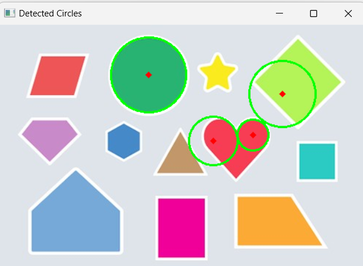

```diff
This is the full package of opencv
-pip install opencv-contrib-python   
This is the main packages of Opencv in here opencv-contribe python is the best practise
-pip install opencv-python 
This library is used to data visualization purpose in python
-pip install matplotlib

Import the opencv package as cv2 naming
-import cv2
Import Numpy packages which giving the all numerical logics in python 
-import numpy as np
import the matplotlib which is data visualization library as plt
-import matplotlib.pyplot as plt

This is used to check the opencv version, I checked this because there are some error occurred situation as best practise
-print(cv2.__version__)

This use to open the image
-img = cv2.imread('C:\\Users\\Hasitha\\Desktop\\kanikaSir\\IM\\preset-shapes.jpg')
-plt.imshow(img)
```
 
```diff
This is the way how to convert RGB image to Gray Color
Uses of the greyscale images
 • To reduce the processing complexity
 • Getting simplified associated Metrix
 • Cutting off the high resolution color distribution
 • Reduce complexity and speed up the processing
-gray = cv2.cvtColor(img, cv2.COLOR_BGR2GRAY)
-plt.imshow(gray)
```


```diff 
This method applying for the image, when the best practice of the machine learning model training because from this method can be improved the smoothiness of the image, like Noice reduction, Details Simplification(for the image blurring is affect to limit the details of the image so this is the preferred way of image preprocessing and image cleaning), and also this is help to edge smoothing concept, and another reason of this blur method it helps to image blending.
-blurred = cv2.GaussianBlur(gray,(5,5),1)
-plt.imshow(blurred)
```


```diff
This canny edge concept is use to detect wide range of edges in the images. When adding gaussian blur method with this canny edge concept can be get the best result. It helps to noice reduction and gradient calculations (this canny edge concept cause to calculate the gradient of an image to find the edges intensity and direction)
-edges = cv2.Canny(blurred,50,150)
-plt.imshow(edges)
```


```diff
Threshold concept is used to identify foreground(objects or interest) getting separately from background based on pixel intensity values. In here the process is this convert the grayscale image to binary image like binary array either set to 0(black) to 255(white) based on specific threshold values.
-_, thresh = cv2.threshold(gray, 127, 255, cv2.THRESH_BINARY)
-plt.imshow(thresh)
```


```diff
This contour concept is used in the open-cv for detecting objects and drawing bounding boxes and also there are several uses from this contour like : shape analysis, Object Detection, Object Recognition, Image Segmentation, and the Boundary representation of the desired object of user. 
-contours, _ = cv2.findContours(thresh, cv2.RETR_EXTERNAL, cv2.CHAIN_APPROX_SIMPLE)

This is process for drawing contours for object highlighting for shape analysis also, 
 • -1: This indicates that all contours should be drawn. If you specify an index, only the contour at that index will be drawn.
 • (0, 255, 0) : The color of the contours, which in this case is green (in BGR format).
 • 2: The thickness of the contour lines.
-cv2.drawContours(img, contours, -1, (0, 255, 0),2)
In this output displayed in GitHub link which I mentioned below 


Find Triangles with Draw the Bounding Boxes 
-def find_triangles(image_path):
-    counting_rectangle = 0;
    Read the Image
-    img = cv2.imread(image_path)

    covert the image to the grayscale
-    gray = cv2.cvtColor(img, cv2.COLOR_BGR2GRAY)

    Apply Gausian blur to reduce noice and help contours detections
-    blurred = cv2.GaussianBlur(gray, (7,7), 0)

    Use canny edge detection to find the edges in the image
-    edges = cv2.Canny(blurred, 30, 150)

     find the contours in the image
-    contours, _ = cv2.findContours(edges, cv2.RETR_EXTERNAL, cv2.CHAIN_APPROX_SIMPLE)

    Itereate through the contours
-    for contour in contours:
        Approximate the contour to the polygon 
-        epsilon = 0.04*cv2.arcLength(contour, True)
-        approx = cv2.approxPolyDP(contour, epsilon, True)

        If the polygon has 3 vertices, it's a triangluar
-        if len(approx) == 3:
             Draw the bounding box around the trianglar (in red)
-            x, y, w, h = cv2.boundingRect(contour)
-            cv2.rectangle(img, (x, y), (x + w, y + h), (0, 0, 255), 2)
-            counting_rectangle += 1

    display the result
-    cv2.imshow('Triangle with bounding boxes : ', img)
-    print(f"There are {counting_rectangle} triangles in the image")
-    cv2.waitKey(0)
-    cv2.destroyAllWindows()


 Given the Image to the find_triangles() functions.
-find_triangles('C:\\Users\\Hasitha\\Desktop\\kanikaSir\\IM\\preset-shapes.jpg')
```


```diff

 Find Squares with Draw the Bounding Boxes 
-def find_squares(image_path):
-    counting_sqaures = 0;
     this tolerance is use to (this is the roundoff theory)
-    tolerance = 1
    
    Read the Image
-    img = cv2.imread(image_path)

    covert the image to the grayscale
-    gray = cv2.cvtColor(img, cv2.COLOR_BGR2GRAY)

    Apply Gaussian blur to reduce noise and help contours detections
-    blurred = cv2.GaussianBlur(gray, (7,7), 0)

     Use canny edge detection to find the edges in the image
-    edges = cv2.Canny(blurred, 30, 150)

     find the contours in the image
-    contours, _ = cv2.findContours(edges, cv2.RETR_EXTERNAL, cv2.CHAIN_APPROX_SIMPLE)


     Iterate through the contours
-    for contour in contours:
        Approximate the contour to the polygon 
-       epsilon = 0.04*cv2.arcLength(contour, True)
-       approx = cv2.approxPolyDP(contour, epsilon, True)

         If the polygon has 4 vertices, it's a square
-      if len(approx) == 4:
             Calculate the distances between consecutive vertices 
-           side_lengths = [cv2.norm(approx[i] - approx[(i + 1) % 4]) for i in range(4)]

             In this way giving the pixel distance as side_length
-           print(side_lengths)
        
             Check if all side lengths are approximately equal
-           if all(abs(side_lengths[i] - side_lengths[(i + 1) % 4]) < tolerance for i in range(4)):
                 Draw the bounding box around the square (in red)
-               x, y, w, h = cv2.boundingRect(contour)
-               cv2.rectangle(img, (x, y), (x + w, y + h), (0, 0, 255), 2)
-               counting_sqaures += 1


    display the result
-    cv2.imshow('sqaure with bounding boxes : ', img)
-    print(f"There are {counting_sqaures} sqaures in the image")
-    cv2.waitKey(0)
-    cv2.destroyAllWindows()

 Giving the original image path
-find_squares('C:\\Users\\Hasitha\\Desktop\\kanikaSir\\IM\\preset-shapes.jpg')
```


```diff

 Find Circle with Draw the Bounding Boxes as Circle
-def find_circle(image_path):
-    counting_circle = 0
    Read the Image
-    img = cv2.imread(image_path)

    covert the image to the grayscale
-    gray = cv2.cvtColor(img, cv2.COLOR_BGR2GRAY)

    Apply Gaussian blur to reduce noise and help contours detections
-    blurred = cv2.GaussianBlur(gray, (7,7), 0)

     Use canny edge detection to find the edges in the image
-    edges = cv2.Canny(blurred, 30, 150)

     find the contours in the image
-    contours, _ = cv2.findContours(edges, cv2.RETR_EXTERNAL, cv2.CHAIN_APPROX_SIMPLE)

     Iterate through the contours
-    for contour in contours:
        Approximate the contour to the polygon 
-        epsilon = 0.04*cv2.arcLength(contour, True)
-        approx = cv2.approxPolyDP(contour, epsilon, True)

        If the polygon has no vertices, it's a circle
-        if len(approx) == 0 :
             Draw the bounding box around the circle (in red)
-            x, y, w, h = cv2.boundingRect(contour)
-            cv2.rectangle(img, (x, y), (x + w, y + h), (0, 0, 255), 2)
-            counting_circle += 1

    display the result
-    cv2.imshow('Triangle with bounding boxes : ', img)
-    print(f"There are {counting_circle} circles in the image")
-    cv2.waitKey(0)
-    cv2.destroyAllWindows()

 Giving the original image path
-find_circle('C:\\Users\\Hasitha\\Desktop\\kanikaSir\\IM\\preset-shapes.jpg')
```

