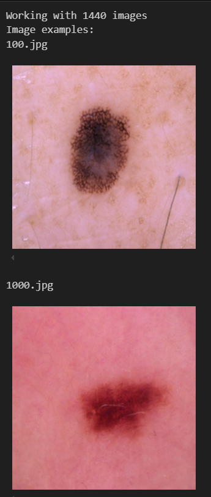
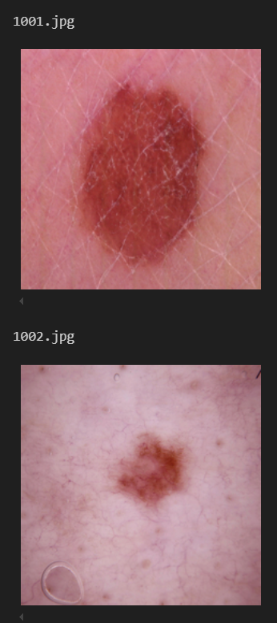
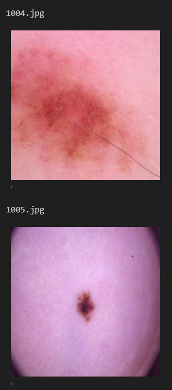
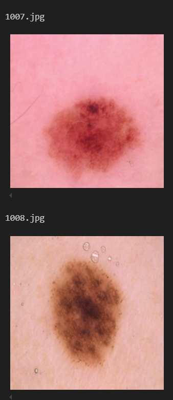
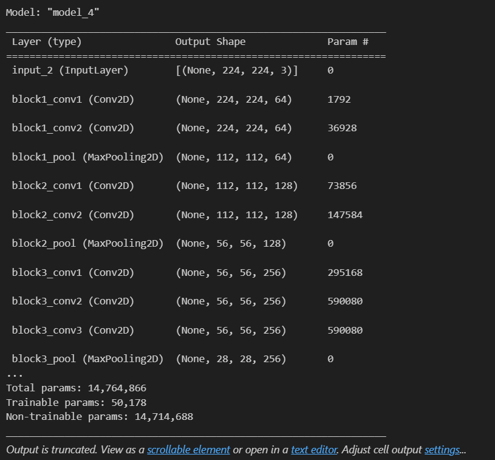
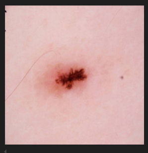
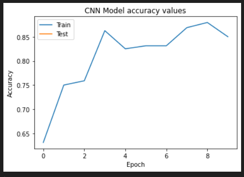

```diff
-from keras.layers import Input, Lambda, Dense, Flatten
-from keras.models import Model
-from keras.applications.vgg16 import VGG16
-from keras.applications.vgg16 import preprocess_input
-from keras.preprocessing import image
-from keras.preprocessing.image import ImageDataGenerator
-from keras.models import Sequential
-import numpy as np
-from glob import glob
-import matplotlib.pyplot as plt
-import numpy as np

to overcome too many unnesessary warning
-import warnings
-warnings.filterwarnings("ignore", category=FutureWarning)

-IMAGE_SIZE = [224, 224]
in transfer leraning, you need to change both the input (i.e. image size & resolution) and the 
output layers (i.e. to suite with the count of classes to be predicted). In between layers and weights 
can be kept as trained from imagenet or other popular weights file
Give dataset path
-train_path = 'C:/Users/kaneekav/PycharmProjects/VGG/dataset/train/'
-test_path = 'C:/Users/kaneekav/PycharmProjects/VGG/dataset/test/'

-from PIL import Image 
-import os 
-from IPython.display import display
-from IPython.display import Image as _Imgdis
creating a object  

filter only for bening images of skin cancer dataset  
-folder = train_path+'/benign'

display only the bening folder data
-onlybenignfiles = [f for f in os.listdir(folder) if os.path.isfile(os.path.join(folder, f))]
-print("Working with {0} images".format(len(onlybenignfiles)))
-print("Image examples: ")

-for i in range(10):
-    print(onlybenignfiles[i])
-    display(_Imgdis(filename=folder + "/" + onlybenignfiles[i], width=240, height=240))
```



    
```diff
-vgg = VGG16(input_shape=IMAGE_SIZE + [3], weights='imagenet', include_top=False)
in above we have defined the image size as 224,224 and it`s rgb there for we pass 3 channels, we re-use imagenet training 
weights. Include_top =false depicts, that the original fully connected layer of the VGG-16 is not going to be loaded.
instead, we plan to load our own fully connected layer to recognize maignent and bening classes.

-vgg.input
-for layer in vgg.layers:
-  layer.trainable = False
do not train the vgg layers with new dataset. Keep the imgenet weights as it is. Only, input and ouput layers are altered.

-folders = glob('C:/Users/kaneekav/PycharmProjects/VGG/dataset/train/*')
-print(len(folders))

-x = Flatten()(vgg.output) # this is the custom fully connected layer we are defining. we say, condense it, 
just to 2 classes only, as the folders vaiable contains the required class counts
-prediction = Dense(len(folders), activation='softmax')(x)
-model = Model(inputs=vgg.input, outputs=prediction) # add the newly created output layer to the VGG model
-model.summary()
```

```diff 

-import tensorflow as tf
-from tensorflow import keras

keras.optimizers.Adam
-optimizer = tf.keras.optimizers.Adam()

define accuracy matrices
-adam = optimizer
-model.compile(loss='binary_crossentropy',
-              optimizer=adam,
-              metrics=['accuracy'])

data augmentation of the skin cancer dataset. will prevent overfitting
-train_datagen = ImageDataGenerator(
-    preprocessing_function=preprocess_input,
-    rotation_range=40,
-    width_shift_range=0.2,
-    height_shift_range=0.2,
-    shear_range=0.2,
-    zoom_range=0.2,
-    horizontal_flip=True,
-    fill_mode='nearest')

-test_datagen = ImageDataGenerator(
-    preprocessing_function=preprocess_input,
-    rotation_range=40,
-    width_shift_range=0.2,
-    height_shift_range=0.2,
-    shear_range=0.2,
-    zoom_range=0.2,
-    horizontal_flip=True,
-    fill_mode='nearest')

-train_set = train_datagen.flow_from_directory(train_path,
-                                                 target_size = (224, 224),
-                                                 batch_size = 32,
-                                                 class_mode = 'categorical')

-test_set = test_datagen.flow_from_directory(test_path,
-                                            target_size = (224, 224),
-                                            batch_size = 32,
-                                            class_mode = 'categorical')

-from datetime import datetime
-from keras.callbacks import ModelCheckpoint

model check points allows to select and save the best model resulted during the epocs

-checkpoint = ModelCheckpoint(filepath='mymodel.h5', 
-                               verbose=2, save_best_only=True)

-callbacks = [checkpoint]

-start = datetime.now()

model training commences
-model_history=model.fit_generator(
-  train_set, # augmented training dataset
-  validation_data=test_set,
-  epochs=10,
-  steps_per_epoch=5,
-  validation_steps=32,
-    callbacks=callbacks ,verbose=2)

-duration = datetime.now() - start
-print("Training completed in time: ", duration)

-from tensorflow.keras.preprocessing import image
-from tensorflow.keras.applications.vgg16 import decode_predictions
-import numpy as np
-img_pth="C:/Users/kaneekav/PycharmProjects/VGG/benigh.jpg"
-img=image.load_img(img_pth,color_mode='rgb', target_size=(224,224))
-display(img)
```

```diff 

-x=image.img_to_array(img)
-x.shape

-x=np.expand_dims(x,axis=0)

-x.shape

-x=preprocess_input(x)
-features=model.predict(x)
-p=decode_predictions(features)
-print(x.shape)

-features=model.predict(x)
-print(features)

Plot training & validation loss values
-plt.plot(model_history.history['accuracy'])
-plt.plot(model_history.history['val_accuracy'])
-plt.title('CNN Model accuracy values')
-plt.ylabel('Accuracy')
-plt.xlabel('Epoch')
-plt.legend(['Train', 'Test'], loc='upper left')
-plt.show()
```

