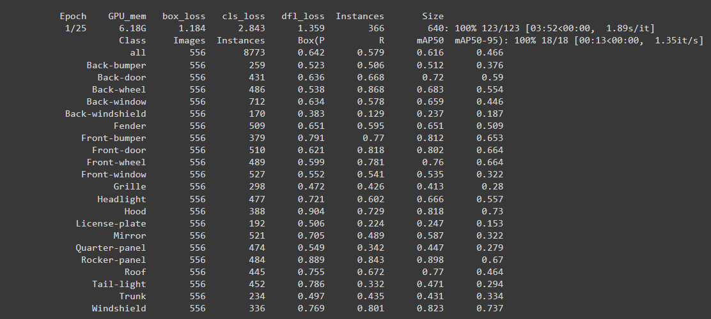
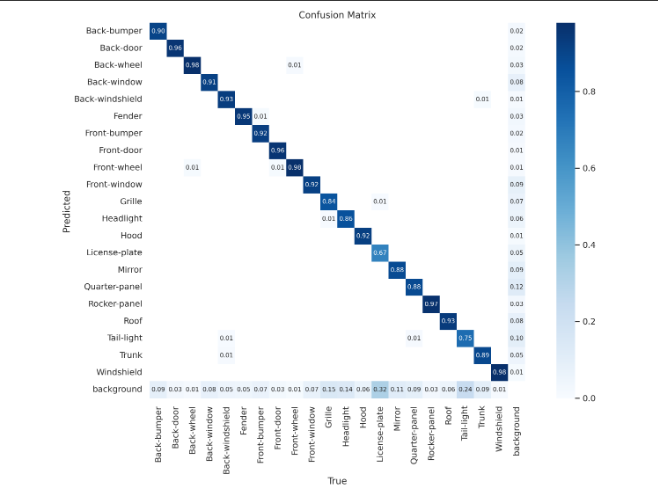
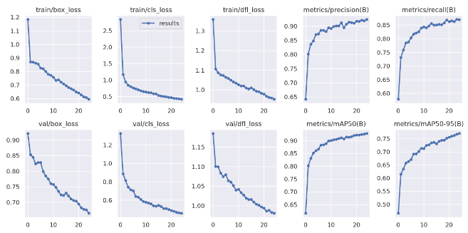
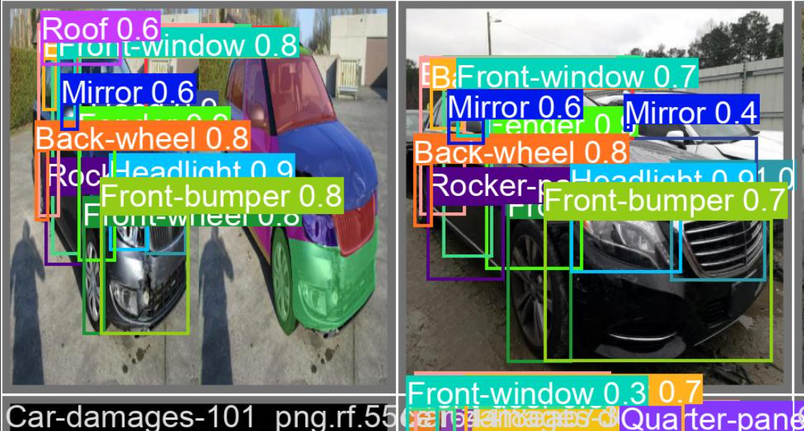

```diff
This use to getting access to the T4 GPU
-!nvidia-smi

Getting directories from google drive home directory
-import os
-HOME = os.getcwd()
-print(HOME)

Insert YOLO algorithm
-!pip install ultralytics==8.0.20
-from IPython import display
-display.clear_output()
-import ultralytics
-ultralytics.checks()

getting YOLO from ultralytics
-from ultralytics import YOLO
-from IPython.display import display, Image

Getting access from Google drive to communicate data
-from google.colab import drive
-drive.mount('/content/drive')

Access to the directory
-%cd  /content/drive/MyDrive/car_parts_datatest(identification)

This is the code for train the model, in the input image size is 640 px, used yolo version 8 small algorithm, with epochs 25.
-!yolo task=detect mode=train model=yolov8s.pt data= data.yaml epochs=25 imgsz=640 plots=True

ls command use to check the directory and read the directory
-!ls runs/detect/train/

Checking the confusion matrix
-Image(filename='runs/detect/train/confusion_matrix.png', width=600)
```
 

```diff
getting the loss function visualization
-Image(filename='runs/detect/train/results.png', width=600)
```
  
```diff
checking the how to predict and output gives
-Image(filename='runs/detect/train/val_batch0_pred.jpg', width=600)
```
 
 
```diff
Rename the model name and balance the weights via yaml file using
-!yolo task=detect mode=val model=runs/detect/train/weights/best.pt data=data.yaml
```
  


This use to getting prediction from the model and then they are saved on mentioned directory (inference with custom model)
-!yolo task=detect mode=predict model=runs/detect/train/weights/best.pt conf=0.25 source=data/test/images save=True

