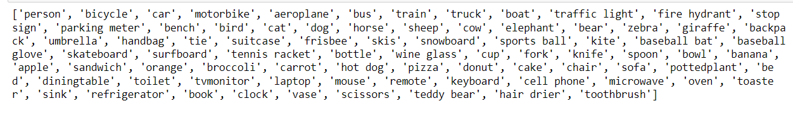
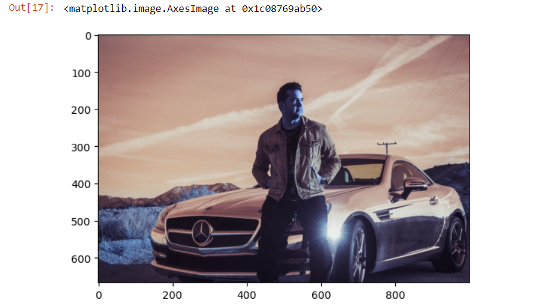
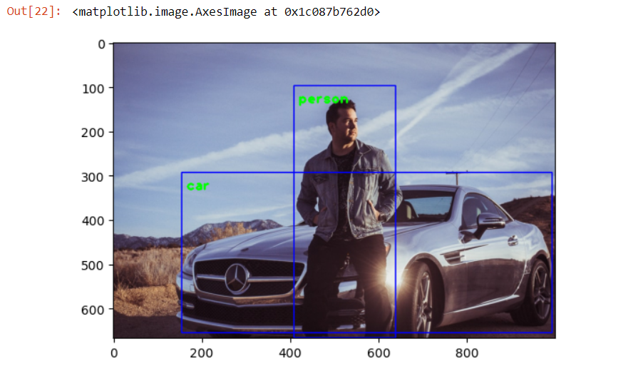

```diff
 special package inside open CV
-import cv2 
-import matplotlib.pyplot as plt

mobile net is pre-trained model for image recognition and object analysis. It`s frozen model is avilable in public as a .pb  file. We have used that, as mentioned below. It required some additional configurations, which is provided by the pbtext file

-config_file='C:\\Users\\Hasitha\\Desktop\\kanikaSir\\objectDetection\\ssd_mobilenet_v3_large_coco_2020_01_14.pbtxt'
-frozen_model='C:\\Users\\Hasitha\\Desktop\\kanikaSir\\objectDetection\\frozen_inference_graph (2).pb'


 cv2.dnn_DetectionModel this is the class provided by OpenCv to creating a detection model. frozen_model, config_file are depicts the paths of directory.
-model = cv2.dnn_DetectionModel(frozen_model, config_file)

 class label file has been downloaded. This is used as enumerator to make the int output provided into text.
 currently, mobile net works for 80 classes. Though we add new classes for the label file, it will not work, hecnce the model is not trained

-classLabels=[]
-file_name="C:\\Users\\Hasitha\\Desktop\\kanikaSir\\objectDetection\\Labels.txt"
-with open (file_name,'rt') as fpt:
-    classLabels=fpt.read().rstrip('\n').split('\n')

 This is used to print the default lables of the saved classes
-print(classLabels)
```

 ```diff

 some adjustments are made to the input. Then the captured input will go through these adjustments. Becz, that1s how config file is organized and , once satisfying these adjusments only, the model can effectively asses the input images / videos
-model.setInputSize(320,320)
-model.setInputScale(1.0/127.5)
-model.setInputMean((127.5,127.5,127.5))
-model.setInputSwapRB(True)

 given the images through opencv 
-img=cv2.imread('C:\\Users\\Hasitha\\Desktop\\kanikaSir\\objectDetection\\download 1.jpg')

-plt.imshow(img) # this is why we need pyplotlib
```
 
```diff	
 some color change filter
-plt.imshow(cv2.cvtColor(img,cv2.COLOR_BGR2RGB))
```
 
```diff
 If the detection confidence is more than 50% display the o/p
-ClassIndex,confidence,bbox=model.detect(img,confThreshold=0.5)

# numerical predications of classes. Check with the class label list, strating from 1. Then, those are man and car
-print(ClassIndex)
```

```diff 
	
-font_scale=2
-font=cv2.FONT_HERSHEY_PLAIN # bounding box text
-for ClassInd,conf,boxes in zip(ClassIndex.flatten(),confidence.flatten(),bbox):
     configuration of bounding box and associated text
-    cv2.rectangle(img,boxes,(255,0,0),2)
-    cv2.putText(img,classLabels[ClassInd-1],(boxes[0]+10,boxes[1]+40),font,fontScale=font_scale,color=(0,255,0),thickness=3) 

-plt.imshow(cv2.cvtColor(img,cv2.COLOR_BGR2RGB))
```


**This is for Realtime Detection**
```diff
 same logic will work for both video and images.
 Type letter q to exist the execution on the image / video canvas

-cap=cv2.VideoCapture('C:\\Users\\Hasitha\\Desktop\\kanikaSir\\objectDetection\\input_video.mp4') # for mp4 video feed  capture

cap=cv2.VideoCapture(0) # for laptop or web camera capture. For external cameras, this 0 should be changed to 1.
-if not cap.isOpened():
-    cap=cv2.VideoCapture(0)
-if not cap.isOpened():
-    raise IOError("Cannot Open Video / Web Cam")
    
-font_scale=2
-font=cv2.FONT_HERSHEY_PLAIN

-while True:
-    ret,frame=cap.read()
-    ClassIndex,confidence,bbox=model.detect(frame,confThreshold=0.55)
-    print(ClassIndex)
-    if(len(ClassIndex))!=0:
-        for ClassInd,conf,boxes in zip(ClassIndex.flatten(),confidence.flatten(),bbox):
-            if(ClassInd <80):
-                cv2.rectangle(frame,boxes,(255,0,0),2)
-                cv2.putText(frame,classLabels[ClassInd-1],(boxes[0]+10,boxes[1]+40),font,fontScale=font_scale,color=(0,255,0),thickness=3)
-    cv2.imshow('Capture',frame)
-    if cv2.waitKey(2) & 0xFF ==ord('q'):
-        break
-cap.release()
-cv2.destroyAllWindows()
        
