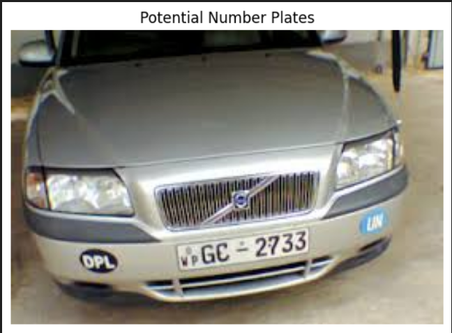

```diff
-import cv2
-import easyocr
-import numpy as np
-from matplotlib import pyplot as plt

-def find_number_plate(image_path):
Load the image
-    img = cv2.imread(image_path)

Convert the image to grayscale
-    gray = cv2.cvtColor(img, cv2.COLOR_BGR2GRAY)

Apply Gaussian blur to reduce noise and improve contour detection
-    blurred = cv2.GaussianBlur(gray, (5, 5), 0)

Use edge detection to find potential contours
Edges are where there is a sudden change in brightness or color
Change range is provided as 50 - 150.
More smaller the value output becomes noisy.
More higher the value output becomes too strict as it could miss some
edges. Hence, start with a mid value like 50 and experiment.
-    edges = cv2.Canny(blurred, 50, 450)

Find contours in the edge-detected image. It`s like connecting the edges
located by the Canny to come up with a closed surface area.
-    contours, _ = cv2.findContours(edges, cv2.RETR_EXTERNAL, cv2.CHAIN_APPROX_SIMPLE)

Filter contours based on area to find potential number plate region.
Check and track cordinates of the closed regions ,approximating with
a size of a number plate.
-   potential_plates = [] #This used to store the contours in potential licence plate
-    for contour in contours: # 
-        area = cv2.contourArea(contour) #calculate the area of the current contour
-        if 1000 < area < 50000:  # Adjust these thresholds based on your specific images (the range of threshold values)
-            potential_plates.append(contour) 

Draw the potential plates on a copy of the original image
-    plate_img = img.copy()
-    cv2.drawContours(plate_img, potential_plates, -1, (0, 255, 0), 2)

  Display the image with potential plates
-    plt.imshow(cv2.cvtColor(plate_img, cv2.COLOR_BGR2RGB))
-    plt.title("Potential Number Plates")
-    plt.axis('off')
-    plt.show()

Example usage
-image_path = 'vehicle_2.jpg'
-find_number_plate(image_path)

```

